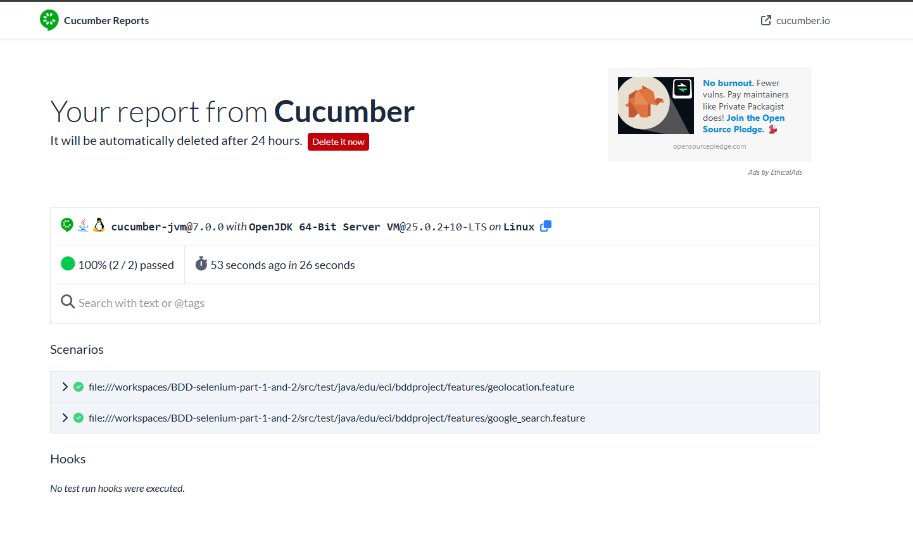
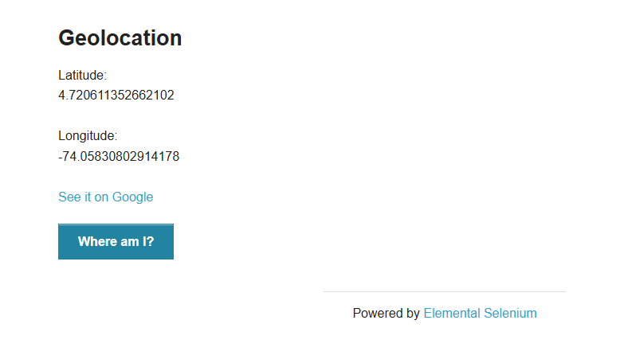

# BDD Part 1 & 2 - Automatización con Cucumber y Selenium

> Proyecto de laboratorio para aprender Behavior-Driven Development (BDD) usando Java, Cucumber y Selenium WebDriver.

---

## ¿Qué hace este proyecto?

> Este proyecto automatiza pruebas de comportamiento sobre un navegador web real.
> Cubre dos laboratorios: el primero automatiza una búsqueda en Google, y el segundo aplica el patrón PageFactory para verificar la geolocalización en una página de prueba.

---

# Parte 1 - Google Search

## ¿Cómo funciona BDD aquí?

> Las pruebas se escriben primero en lenguaje natural (archivos `.feature`), y luego se implementa el código que las ejecuta paso a paso.

El escenario de prueba es:

```gherkin
Feature: Google Search

  Scenario: Search for a term
    Given I am on the Google search page
    When I search for "GitHub"
    Then I should see "GitHub" in the results
```

> Cada línea del escenario (`Given`, `When`, `Then`) tiene una función Java que la ejecuta automáticamente.

---

## Resultado de la ejecución

> Al correr `mvn test`, Cucumber ejecuta el escenario en un navegador Chrome en modo headless (sin ventana visible) y genera un reporte HTML con los resultados.


> El reporte muestra cada paso del escenario con una marca verde si pasó correctamente.

---

## Estructura del proyecto - Parte 1

```
src/
 test/
  java/
   edu/eci/bddproject/
    features/
     google_search.feature   <- Escenario en lenguaje natural
    runners/
     TestRunner.java          <- Configura y lanza Cucumber
    steps/
     SearchSteps.java         <- Implementación de cada paso
```

---

# Parte 2 - Geolocation con PageFactory

## ¿Qué es el patrón PageFactory?

> PageFactory es una forma de organizar el código de Selenium donde cada página web tiene su propia clase Java. En lugar de buscar elementos directamente en los steps con `driver.findElement(...)`, se declaran con la anotación `@FindBy` y PageFactory los conecta automáticamente al navegador.

Sin PageFactory:
```java
// Los elementos se buscan directamente en los steps
WebElement button = driver.findElement(By.cssSelector("button"));
button.click();
```

Con PageFactory:
```java
// GeolocationPage.java
@FindBy(css = "button")
private WebElement whereAmIButton;

public GeolocationPage(WebDriver driver) {
    PageFactory.initElements(driver, this); // conecta los elementos
}

public void clickWhereAmI() {
    whereAmIButton.click();
}
```

> Esto hace el código más limpio, reutilizable y fácil de mantener.

---

## ¿Qué automatiza la Parte 2?

> El test navega a la página de Geolocation de [The Internet](https://the-internet.herokuapp.com/geolocation), inyecta coordenadas de Bogotá, Colombia usando Chrome DevTools Protocol (CDP), hace clic en el botón "Where am I?" y verifica que la latitud y longitud aparezcan en pantalla.

El escenario de prueba es:

```gherkin
Feature: Geolocation

  Scenario: User can see their coordinates after clicking Where Am I
    Given I am on the Geolocation page
    When I click the "Where am I?" button
    Then I should see my latitude on the screen
    And I should see my longitude on the screen
```

---

## ¿Qué es CDP y por qué lo usamos?

> Chrome DevTools Protocol (CDP) es una API interna de Chrome que permite controlar el navegador a bajo nivel. Lo usamos para simular una ubicación GPS falsa (Bogotá: 4.711, -74.0721) porque en modo headless el navegador no tiene acceso real al GPS del sistema.

---

## Resultado de la ejecución

> Los 2 scenarios (Google Search y Geolocation) pasan correctamente al correr `mvn test`.



> El reporte muestra ambos features ejecutados con éxito en 26 segundos.




> La página muestra la latitud y longitud simuladas tras hacer clic en el botón.

---

## Estructura del proyecto - Parte 2

```
src/
 test/
  java/
   edu/eci/bddproject/
    features/
     geolocation.feature     <- Escenario de geolocalización
    pages/
     GeolocationPage.java    <- Page Object con @FindBy (PageFactory)
    steps/
     GeolocationSteps.java   <- Implementación de los steps
```

---

## Tecnologías usadas

> El proyecto combina varias herramientas del ecosistema de pruebas en Java:

- **Java** - Lenguaje principal
- **Maven** - Gestión de dependencias y ejecución de pruebas
- **Cucumber** - Framework BDD que interpreta los archivos `.feature`
- **Selenium WebDriver 4.41** - Controla el navegador automáticamente
- **PageFactory** - Patrón de diseño para organizar Page Objects
- **Chrome DevTools Protocol (CDP)** - Simula la ubicación GPS en headless
- **Google Chrome for Testing + ChromeDriver** - Navegador usado para las pruebas
- **JUnit 4** - Runner que lanza los tests

---

## ¿Cómo correr las pruebas?

> Asegúrate de tener Java, Maven y ChromeDriver instalados antes de ejecutar.

```bash
mvn test
```

> El reporte HTML se genera en `target/HtmlReports/report.html`.

---

## Autora

> María Paula Sánchez Macías